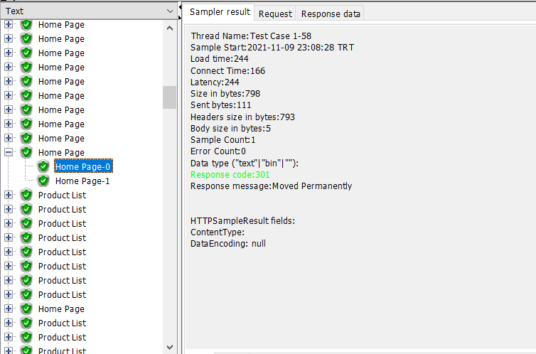
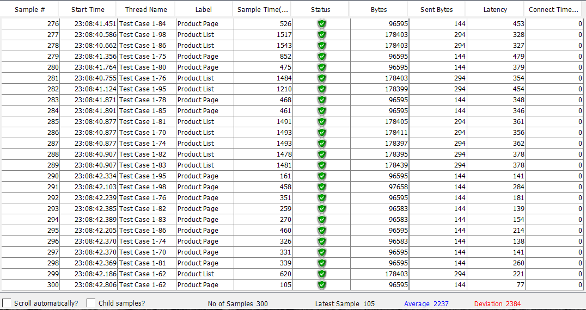
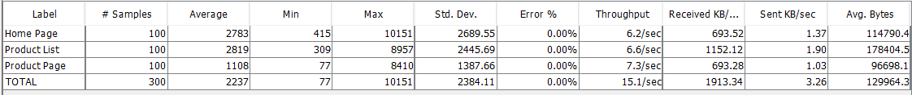

# Load Testing with Apache JMeter

#### Dowload Apache JMeter: https://jmeter.apache.org/download_jmeter.cgi

### What is JMeter?

The Apache JMeter application is open source software, designed to load test functional behavior and measure performance.   Apache JMeter may be used to test performance both on static and dynamic resources, Web dynamic applications.   It can be used to simulate a heavy load on a server, group of servers, network or object to test its strength or to analyze overall performance under different load types.

#### Sample Case Test Results:

